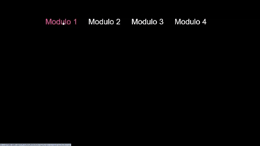

No início do meu aprendizado, completei o curso de HTML e CSS do Gustavo Guanabara. Durante o curso, segui as atividades práticas e teóricas propostas nas aulas em vídeo, aplicando os conceitos aprendidos na criação de diversos desafios e projetos.

  

